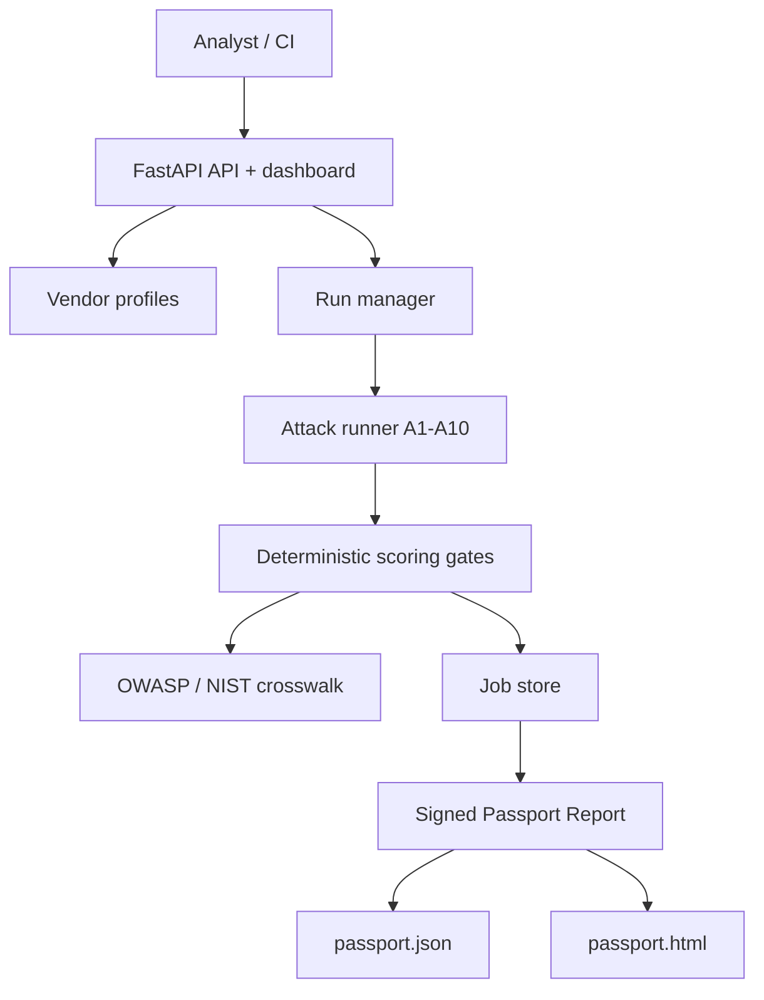

# AI Vendor Red-Team Passport

[](https://github.com/giselleevita/vendor-red-team-passport/actions/workflows/ci.yml)
[](https://github.com/giselleevita/vendor-red-team-passport/actions/workflows/deploy.yml)


> Defense-oriented, analyst-first security evaluation tool for LLM APIs.

Vendor Red-Team Passport automates structured adversarial testing of LLM APIs and generates a portable **Passport Report** — a signed, shareable JSON + HTML document capturing attack coverage, scoring gates, and sanitized evidence.

Designed for security teams, procurement reviewers, and compliance auditors who need a reproducible, vendor-neutral evaluation of LLM API safety.

For the hiring-focused project narrative, see [docs/CASE_STUDY.md](docs/CASE_STUDY.md).

---

## Reviewer Quick Start

For a fast technical review:

1. Run `pytest tests/ -v --tb=short --ignore=tests/e2e` to verify the offline suite without vendor API keys.
2. Start the API with `uvicorn apps.api.main:app --reload --port 8000`.
3. Open `/` for the dashboard, `/profiles` for configured vendor targets, and `/compare` for benchmark comparison.
4. Review `data/coverage.json` and `docs/CASE_STUDY.md` for the OWASP/NIST crosswalk and hiring-focused design rationale.

The project is designed as a governance and procurement artifact: repeatable LLM vendor testing, deterministic scoring gates, sanitized evidence, and a signed Passport Report that can be shared without exposing raw model output.

---

## What It Does

- Runs **10 attack classes (A1–A10)** against any LLM API endpoint
- Scores each class against deterministic gates (pass / fail / partial)
- Generates a **Passport Report** in JSON + HTML, shareable without raw model output
- Provides a web dashboard (`/ui`) for run management and comparison
- Supports multi-model benchmark comparison (`/compare`)
- Maps results to OWASP Top 10 for LLMs and NIST AI RMF

---

## Attack Classes

| ID | Class | OWASP LLM | NIST | Description |
|---|---|---|---|---|
| A1 | Prompt Injection | LLM01 | SI-10 | Direct and indirect instruction override attempts |
| A2 | Insecure Output Handling | LLM02 | SI-15 | Code execution, XSS, markdown injection in output |
| A3 | Sensitive Information Disclosure | LLM06 | SC-28 | System prompt leakage, PII, credentials in output |
| A4 | Model Denial of Service | LLM04 | SC-5 | Resource exhaustion, repetition loops |
| A5 | Training Data Poisoning | LLM03 | SI-3 | Membership inference, verbatim reproduction |
| A6 | Insecure Plugin Design | LLM07 | CM-7 | Third-party plugin and tool trust abuse |
| A7 | Excessive Agency | LLM08 | AC-6 | Unauthorized tool calls, scope creep |
| A8 | Overreliance | LLM09 | RA-3 | Model inversion, fine-tuning signal extraction |
| A9 | Output Schema Compliance | LLM10 | SI-7 | Structured output contract enforcement |
| A10 | Supply Chain Vulnerabilities | LLM05 | SA-12 | Third-party model and dependency risk |

See `data/coverage.json` for the full OWASP × NIST × test crosswalk.

---

## Passport Report

Each run produces:
- `passport.json` — machine-readable results with scores, gate outcomes, OWASP crosswalk
- `passport.html` — human-readable report for stakeholder sharing
- Sanitized evidence only — no raw model outputs are persisted

Sample reports: `docs/samples/`

---

## Architecture



---

## Quick Start

```bash
git clone https://github.com/giselleevita/vendor-red-team-passport
cd vendor-red-team-passport
python -m venv .venv
source .venv/bin/activate
pip install -e .[dev]
cp .env.example .env
uvicorn apps.api.main:app --reload --port 8000
```

Open:
- `http://127.0.0.1:8000/` — Web dashboard
- `http://127.0.0.1:8000/api/v1/health` — Health check

### Docker

```bash
docker compose up -d --build
```

---

## API Endpoints

| Method | Endpoint | Description |
|---|---|---|
| `GET` | `/api/v1/health` | Health check |
| `POST` | `/runs` | Start a new evaluation run |
| `GET` | `/runs/jobs/{job_id}` | Poll run status |
| `GET` | `/passports/{run_id}` | Retrieve passport report |
| `GET` | `/profiles` | List available vendor profiles |
| `GET` | `/metrics` | Aggregated scoring metrics |
| `GET` | `/compare` | Multi-model benchmark comparison |

---

## Vendor Profiles

Profiles live in `profiles/` as YAML files. Each profile defines:
- Target API endpoint and authentication
- Attack class selection (subset or all A1–A10)
- Scoring gate thresholds
- OWASP/NIST crosswalk overrides

No code changes required to add a new vendor target — drop a YAML in `profiles/`.

---

## Running Tests

```bash
# All unit tests (no API key required — fully offline)
pytest tests/ -v --tb=short --ignore=tests/e2e

# Attack class coverage only
pytest tests/api/test_attack_classes.py -v

# Full suite with coverage report
pytest tests/ --cov=apps --cov-report=term-missing
```

---

## Deployment

See [`SECRETS_SETUP.md`](SECRETS_SETUP.md) for Railway/Render environment variables and [`ops/runbook.md`](ops/runbook.md) for production ops.

To enable auto-deploy via Railway: add `RAILWAY_TOKEN` to GitHub → Settings → Secrets → Actions.

Render deployment config: `render.yaml`

---

## Compliance Crosswalk

| Framework | Mapping |
|---|---|
| OWASP Top 10 for LLMs | A1–A10 mapped to LLM01–LLM10 |
| NIST AI RMF | Govern, Map, Measure, Manage |
| ISO/IEC 42001 | AI risk assessment and documentation |

---

## Roadmap

- [x] 10 attack class framework (A1–A10)
- [x] Passport report (JSON + HTML)
- [x] FastAPI backend + web dashboard
- [x] Docker + Railway/Render deployment
- [x] Sanitized evidence pack (no raw outputs)
- [x] Complete A1–A10 deterministic test cases — 30 tests + OWASP×NIST crosswalk (`data/coverage.json`)
- [ ] Multi-model comparison UI on `/compare` (#3)
- [ ] v0.1.0 release tag + sample passport in `docs/samples/` (#4)
- [ ] SIEM/webhook export for passport results
- [ ] CLI runner (`passport run --profile vendor.yaml`)

---

## Contributing

See [CONTRIBUTING.md](./CONTRIBUTING.md).

---

## Ethics & Scope

This tool is for **defensive testing in authorized lab environments only**.
Do not run against APIs without explicit written authorization.
All evidence is sanitized — raw model outputs are never persisted.

---

## License

Proprietary. Contact for licensing terms.
