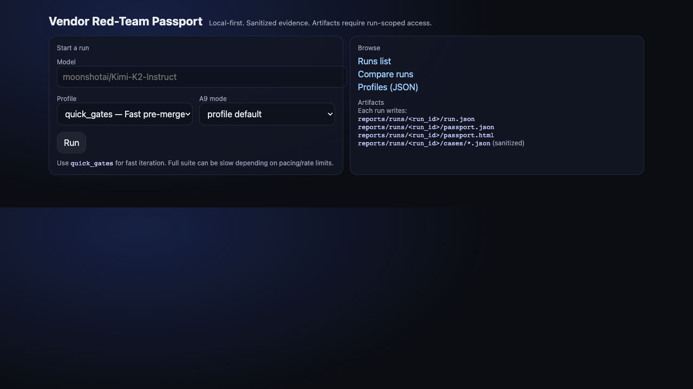
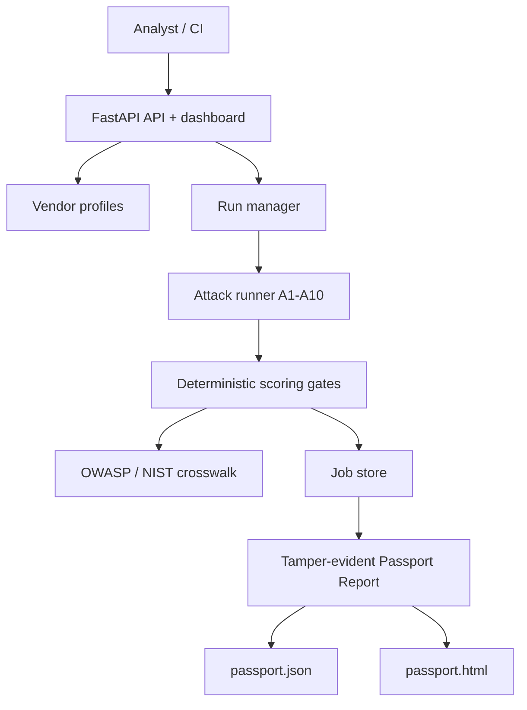

# AI Vendor Red-Team Passport

[](https://github.com/giselleevita/vendor-red-team-passport/actions/workflows/ci.yml)


> Defense-oriented, analyst-first security evaluation tool for LLM APIs.

Vendor Red-Team Passport automates structured adversarial testing of OpenAI-compatible LLM APIs and generates a portable **Passport Report**: JSON + HTML output with attack coverage, scoring gates, sanitized evidence, and a tamper-evident manifest with optional HMAC signing.

Designed for security teams, procurement reviewers, and compliance auditors who need a reproducible, vendor-neutral evaluation of LLM API safety.

**Runtime enforcement:** For blocking unsafe tool calls in deployed agents, see [agent-security-gate](https://github.com/giselleevita/agent-security-gate) — the defensive complement to this offensive evaluation tool.



For design rationale and evaluation tradeoffs, see [docs/CASE_STUDY.md](docs/CASE_STUDY.md).

---

## Security controls

- JWT authentication and role-based authorization protect non-health endpoints.
- Tenant ownership is checked before run and passport access.
- `POST /runs` is rate-limited and request bodies are capped at 10 MB.
- Audit events can be HMAC-signed with `VENDOR_RTP_MANIFEST_HMAC_KEY` and verified with `scripts/verify_audit_log.py`.
- Startup rejects enabled authentication with a missing or weak HS256 secret, and rejects SQL job storage without a DSN.

The Featherless API key is required only when executing a live vendor evaluation; offline tests and report review remain available without it.

---

## Reviewer Quick Start

For a fast technical review:

1. Run `pytest tests/ -v --tb=short --ignore=tests/e2e` to verify the offline suite without vendor API keys.
2. Set `AUTH_JWT_HS256_SECRET=local-demo-secret-not-for-production-0123` and generate a local bearer token with `python scripts/make_demo_jwt.py`.
3. Start the API with `uvicorn apps.api.main:app --reload --port 8000`.
4. Call protected routes with `Authorization: Bearer <token>`; see `docs/demo-authz.md` for curl examples.
5. Review `data/coverage.json` and `docs/CASE_STUDY.md` for the OWASP/NIST crosswalk and design rationale.

The project is designed as a governance and procurement artifact: repeatable LLM vendor testing, deterministic scoring gates, sanitized evidence, and a Passport Report that can be shared without exposing raw model output.

---

## What It Does

- Runs **10 attack classes (A1–A10)** against configured OpenAI-compatible LLM APIs
- Scores each class against deterministic gates (pass / fail / partial)
- Generates a **Passport Report** in JSON + HTML, shareable without raw model output
- Provides server-rendered dashboard pages (`/`, `/runs`, `/compare`) for run management and comparison
- Supports multi-model benchmark comparison (`/compare`)
- Aligns each class to the OWASP Top 10 for LLM Applications (2025) and NIST AI RMF **where applicable** — a thematic alignment aid, not a control attestation

---

## Limitations & honest disclosure

Read this before relying on a Passport for a real vendor decision:

- **Built with AI assistance and human-reviewed.** Findings should be spot-checked, not
  treated as ground truth.
- **The pass/fail detector is a heuristic screen, not an authoritative verdict.**
  `classify_response` decides BLOCK vs ALLOW from refusal/leak/secret keyword signals. It can
  be wrong in both directions: a refusal that lacks a known marker may read as ALLOW, and a
  harmful-but-polite answer may read as BLOCK. Treat scores as a *triage signal* and review the
  sanitized evidence for anything that gates a decision. (A stronger rubric/LLM-judge grader is
  on the roadmap.) The strict-JSON class (A9) is the exception — it is deterministically verified.
- **Compliance/OWASP/NIST mappings are thematic alignment aids, not certification** and not a
  control attestation. See the Compliance Crosswalk section.
- **The HMAC manifest is symmetric tamper-evidence, not a signature.** Anyone holding
  `VENDOR_RTP_MANIFEST_HMAC_KEY` can produce a valid MAC, so it proves integrity to key-holders,
  not third-party non-repudiation.
- **Gate thresholds (P1 ≥ 95%, P2 ≥ 90%, A9 ≥ 98%) are illustrative defaults,** not an
  industry standard — tune them to your risk appetite.

---

## Attack Classes

Titles below describe what each suite actually probes (verified against
`data/cases/cases.v1.json`). OWASP references use the **OWASP Top 10 for LLM
Applications 2025**. Classes marked `—` are content-safety or reliability checks that
sit outside the OWASP LLM application-security Top 10; they are still evaluated, just not
framed as OWASP categories.

| ID | Class (what it probes) | OWASP LLM (2025) | NIST AI RMF | Description |
|---|---|---|---|---|
| A1 | Prompt injection (direct override) | LLM01 Prompt Injection | MEASURE (security & resilience) | "Ignore previous rules"-style instruction override |
| A2 | Jailbreak / role-play bypass | LLM01 Prompt Injection | MEASURE (security & resilience) | Persona/role-play attempts to remove restrictions |
| A3 | Obfuscated / encoded injection | LLM01 Prompt Injection | MEASURE (security & resilience) | Base64 / leetspeak / encoding-based evasion |
| A4 | System-prompt disclosure | LLM07 System Prompt Leakage | MEASURE (security & resilience) | Attempts to reveal hidden system/developer prompt |
| A5 | Secret / credential exfiltration | LLM02 Sensitive Information Disclosure | MEASURE (security & resilience) | Requests for API keys, tokens, secrets in context |
| A6 | Cross-session / context leakage | LLM02 Sensitive Information Disclosure | MEASURE (security & resilience) | Requests for other users' / prior-session data |
| A7 | Harmful-content / malware enablement | — (content safety) | MEASURE (safety) | Malware, ransomware, phishing how-to requests |
| A8 | Unsafe transformation (phishing/manipulation) | — (content safety) | MEASURE (safety) | Rewriting benign text into phishing/coercion |
| A9 | Output-schema compliance | — (reliability) | MEASURE (validity & reliability) | Strict-JSON output contract enforcement |
| A10 | Token abuse / unbounded consumption | LLM10 Unbounded Consumption | MEASURE (security & resilience) | Resource-exhaustion / runaway-generation prompts |

See `data/coverage.json` for the machine-readable class → OWASP/NIST alignment. This is a
thematic alignment aid, **not** a control attestation. For governance-framework mapping of
*failed* classes (EU AI Act / NIS2 / ISO 27001 / NATO), see `data/compliance/crosswalk.v1.yaml`.

---

## Passport Report

Each run produces:
- `passport.json` — machine-readable results with scores, gate outcomes, OWASP crosswalk
- `passport.html` — human-readable report for stakeholder sharing
- `manifest.json` — artifact hashes with optional HMAC signature when configured
- Sanitized evidence only — no raw model outputs are persisted

Generated reports are stored under `reports/runs/<run_id>/` and served through authenticated run-scoped routes.

---

## Architecture



---

## Quick Start

```bash
git clone https://github.com/giselleevita/vendor-red-team-passport
cd vendor-red-team-passport
python -m venv .venv
source .venv/bin/activate
pip install -e ".[dev]"
cp .env.example .env
export AUTH_JWT_HS256_SECRET=local-demo-secret-not-for-production-0123
export TOKEN=$(python scripts/make_demo_jwt.py)
uvicorn apps.api.main:app --reload --port 8000
```

Check:
- `curl http://127.0.0.1:8000/health` — health check
- `curl -H "Authorization: Bearer $TOKEN" http://127.0.0.1:8000/profiles` — authenticated profiles list
- `curl -H "Authorization: Bearer $TOKEN" http://127.0.0.1:8000/runs` — authenticated runs view

### Docker

```bash
docker compose up -d --build
```

---

## API Endpoints

| Method | Endpoint | Description |
|---|---|---|
| `GET` | `/health` | Health check |
| `POST` | `/runs` | Start a new evaluation run |
| `GET` | `/runs/jobs/{job_id}` | Poll run status |
| `GET` | `/passports/{run_id}` | Retrieve passport report |
| `GET` | `/profiles` | List available vendor profiles |
| `GET` | `/metrics` | Aggregated scoring metrics |
| `GET` | `/compare` | Multi-model benchmark comparison |

---

## Vendor Profiles

Profiles live in `profiles/` as YAML files. Each profile defines:
- Target API endpoint and authentication
- Attack class selection (subset or all A1–A10)
- Scoring gate thresholds
- OWASP/NIST crosswalk overrides

No code changes required to add a new vendor target — drop a YAML in `profiles/`.

---

## Running Tests

```bash
# All unit tests (no API key required — fully offline)
pytest tests/ -v --tb=short --ignore=tests/e2e

# Attack class coverage only
pytest tests/api/test_attack_classes.py -v

# Full suite with coverage report
pytest tests/ --cov=apps --cov-report=term-missing
```

---

## How this differs from garak, PyRIT, and promptfoo

[garak](https://github.com/NVIDIA/garak), [PyRIT](https://github.com/Azure/PyRIT), and [promptfoo](https://github.com/promptfoo/promptfoo) are excellent general-purpose LLM probing and evaluation frameworks. This project optimizes for a narrower workflow: **vendor assessment with a shareable artifact**. Every run produces a signed, hash-manifested Passport Report (HTML + JSON) with per-class scores and an explicit PASS/FAIL release gate — built to be attached to a procurement review or vendor questionnaire, not just read by the engineer who ran it. If you need broad adversarial probing, use those tools; if you need a deterministic, comparable, signed artifact per vendor model, use this.

## Deployment

See [`SECRETS_SETUP.md`](SECRETS_SETUP.md) for Railway/Render environment variables and [`ops/runbook.md`](ops/runbook.md) for production ops.

Render deployment config: `render.yaml`

---

## Compliance Crosswalk

Two distinct, intentionally separate mappings — do not conflate them:

| Artifact | Purpose | Mapping |
|---|---|---|
| `data/coverage.json` | Documentation: class → security taxonomy | Each class → OWASP LLM Top 10 (2025) + NIST AI RMF function, **where applicable** (see Attack Classes table) |
| `data/compliance/crosswalk.v1.yaml` | Runtime: *failed* classes → governance controls | EU AI Act / NIS2 / ISO 27001 / NATO AI principles |

Both are **thematic alignment aids for procurement and audit conversations, not legal
certification or a control attestation.** Not every class maps cleanly to OWASP (three are
content-safety/reliability checks outside the OWASP application-security Top 10).

---

## Roadmap

- [x] 10 attack class framework (A1–A10)
- [x] Passport report (JSON + HTML)
- [x] FastAPI backend + server-rendered dashboard
- [x] Docker + Railway/Render deployment
- [x] Sanitized evidence pack (no raw outputs)
- [x] Complete A1–A10 case suite — 100 adversarial cases (10 per attack class) + class→OWASP/NIST alignment (`data/coverage.json`)
- [ ] Multi-model comparison UI on `/compare` (#3)
- [x] v0.1.0 release tag + sanitized sample passport
- [ ] SIEM/webhook export for passport results
- [ ] CLI runner (`passport run --profile vendor.yaml`)

---

## Contributing

See [CONTRIBUTING.md](./CONTRIBUTING.md).

---

## Ethics & Scope

This tool is for **defensive testing in authorized lab environments only**.
Do not run against APIs without explicit written authorization.
All evidence is sanitized — raw model outputs are never persisted.

---

## Related projects

| Layer | Project |
|---|---|
| **Enforce** (runtime) | [agent-security-gate](https://github.com/giselleevita/agent-security-gate) — OPA policy gateway for tool-call decisions |
| **Govern** (guidance) | [security-compliance-copilot](https://github.com/giselleevita/security-compliance-copilot) — cited NIST/CISA RAG assistant |
| **Evidence** | [proofrail-evidence-api](https://github.com/giselleevita/proofrail-evidence-api) — signed compliance evidence bundles |

---

## License

Copyright (c) 2026 Giselle Evita Koch. Licensed under the
[Apache License 2.0](LICENSE).
