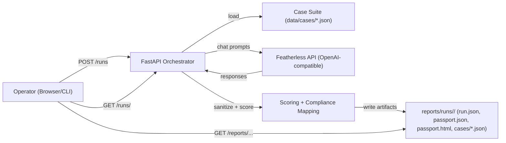

# Architecture (Local-First)

## High-Level
- FastAPI service orchestrates runs and serves a small HTML UI.
- Evaluations call the Featherless OpenAI-compatible chat API.
- Artifacts are written to disk under `reports/` and served locally via `GET /reports/...`.
- Scoring is deterministic given a suite version and recorded parameters.

## Components
- `apps/api/routes/run.py`: `POST /runs` orchestration entrypoint (JSON body).
- `profiles/*.yaml`: run profiles (quick gates, full suite, high sensitivity).
- `apps/api/services/orchestrator.py`: run orchestrator + HTML passport renderer.
- `apps/api/services/evaluator.py`: case execution, A9 structured-output handling, latency tracking.
- `apps/api/services/redaction.py`: sanitized-only persistence for evidence excerpts.
- `apps/api/services/run_store.py`: artifact layout and persistence.
- `apps/api/services/manifest.py`: tamper-evident manifest (sha256, optional HMAC).

## Data Flow (Mermaid)

## Artifact Contract (Per Run)
Each run produces:
- `run.json`: model, params, suite_version, timestamps, a9_mode_used
- `passport.json`: decision summary, per-class scoring, failed cases
- `passport.html`: decision-ready report
- `policy.json`: explicit scoring/gating policy for audit trails
- `coverage.json`: OWASP/NIST crosswalk coverage (heuristic, communication aid)
- `compliance.json`: control mapping output for the run
- `manifest.json`: sha256 list for artifacts (optional HMAC signature)
- `cases/*.json`: per-case sanitized evidence (excerpt + hashes + latency)
