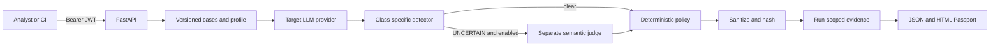

# Architecture and Data Flow

## Runtime flow

```mermaid
flowchart LR
  O[Analyst or CI] -->|Bearer JWT| API[FastAPI]
  API --> CASES[Versioned cases and profile]
  CASES --> TARGET[Target LLM provider]
  TARGET --> RULES[Class-specific detector]
  RULES -->|clear| SCORE[Deterministic policy]
  RULES -->|UNCERTAIN and enabled| JUDGE[Separate semantic judge]
  JUDGE --> SCORE
  SCORE --> SAN[Sanitize and hash]
  SAN --> STORE[Run-scoped evidence]
  STORE --> PASS[JSON and HTML Passport]
```

## Trust boundaries

- **Caller to API:** Bearer JWT, role checks, and object-level tenant ownership.
- **API to target provider:** prompts leave the local process; provider handling is outside this repository.
- **API to semantic judge:** only ambiguous prompt/response pairs are transmitted when explicitly enabled. The judge is separate from the evaluated model.
- **Process to filesystem:** raw prompts and raw responses are excluded; sanitized excerpts, hashes, decisions, metadata, and reports persist.
- **Static public demo:** synthetic content only; it contains no API and no credentials.

## Components

- FastAPI routes handle authenticated run, report, artifact, and comparison access.
- Profiles select suite, class subset, structured-output mode, and model parameters; credentials remain environment configuration.
- The evaluator produces `BLOCK`, `ALLOW`, `UNCERTAIN`, strict-schema, or error decisions with provenance.
- The scoring service applies a versioned fail-closed policy.
- The run store writes tenant-owned artifacts and manifests under the configured reports directory.

## Evidence contract

Each case artifact contains a sanitized excerpt, prompt/excerpt hashes, verdict, pass state, latency, evaluator version, decision source, confidence, reason codes, judge model, and human-review flag. Each run records taxonomy and evaluation-policy versions so historical results remain interpretable after future changes.
